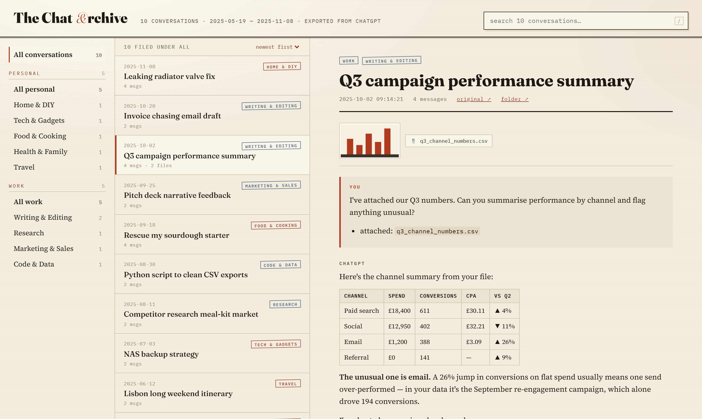
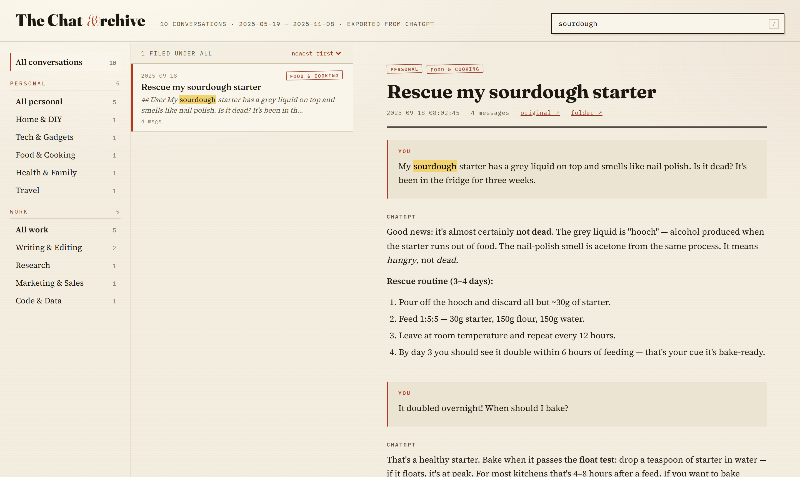

# scrapemychats

**Leaving a ChatGPT business account? This tool saves your conversations
before they're gone.**

ChatGPT's **business and Team accounts often have no "Export data" button** —
the one-click archive that personal accounts get is simply missing, and
there's no official way to take your conversation history with you when the
workspace is closed or your subscription is cancelled. scrapemychats fills
that gap: it exports **every conversation — text and attached files — to
your own computer**, then builds a beautiful, searchable, offline archive
you can keep forever. (It works on personal accounts too.)

**Your data never leaves your machine.** The tool drives a real Chrome
window on your computer using your own logged-in ChatGPT session. It never
sees your password, and nothing is sent anywhere except to chatgpt.com
itself.


*The offline viewer: categories on the left, your chats in the middle, the full conversation — tables, files, images — on the right. (Sample data shown.)*

## What you get

```
export/
├── viewer.html                     ← open this: search + browse everything
├── manifest.csv                    ← one row per chat: status, counts
├── errors.log                      ← anything that couldn't be fetched
└── 001_Some Chat Title_6a5f6592/
    ├── conversation.json           ← complete raw data (every message, tool call)
    ├── conversation.md             ← readable transcript
    └── files/                      ← attachments, images & generated files
```

The viewer is a single self-contained HTML file: instant full-text search
across all chats, optional Personal/Work categorisation, inline image
thumbnails, keyboard navigation. No server, no internet, no dependencies —
it works from a USB stick.


*Full-text search is instant and highlights matches in the results and inside the open chat. (Sample data shown.)*

---

## Get it

There are two ways to run scrapemychats. **Both produce the exact same
archive** — same folder layout, same resume markers, same `manifest.csv`,
same viewer — so they're completely interchangeable. You can even start with
one and finish with the other.

### Option A — Download the app (no Python, recommended for most people)

A single self-contained program. No installation, no dependencies to set up.
It still drives **your own** Chrome or Edge, so make sure one of those is
installed (on Windows, Edge is already there).

<details open>
<summary><strong>macOS</strong></summary>

The macOS builds are **signed with an Apple Developer ID and notarized by
Apple**, so they run without the old "unidentified developer" block — no
right-click tricks, no `xattr`.

**Easiest — the one-line installer** (auto-detects Intel vs Apple Silicon):

```sh
curl -fsSL https://raw.githubusercontent.com/saigyo/scrapemychats/main/install.sh | sh
```

It downloads the right binary into `~/Documents/scrapemychats` and tells you
how to run it. (Pass a folder to install elsewhere:
`… | sh -s -- ~/Apps/scrapemychats`.)

**Or download the zip manually** from the
[Releases page](https://github.com/saigyo/scrapemychats/releases). The build
is per-CPU, so pick the one for your Mac:

- **Apple Silicon** (M1/M2/M3/M4…) → `scrapemychats_darwin_arm64.zip`
- **Intel** → `scrapemychats_darwin_amd64.zip`

Not sure which you have? **Apple menu → About This Mac** and look for
"Apple M-series" (Apple Silicon) or "Intel". (The `curl` installer picks
automatically — the easy path if you'd rather not check.)

Unzip it and run the `scrapemychats` program. Double-clicking a bare
command-line binary opens it in a Terminal window — that's expected. On the
very first launch macOS may pause a moment to verify the notarization online;
that's normal, and it doesn't happen again.

</details>

<details>
<summary><strong>Windows</strong></summary>

1. Download `scrapemychats_windows_amd64.zip` from the
   [Releases page](https://github.com/saigyo/scrapemychats/releases).
2. In File Explorer, right-click the zip → **Extract All**.
3. Double-click `scrapemychats.exe`.
4. Windows SmartScreen may warn that it's from an unknown publisher. Click
   **More info → Run anyway** (a one-time thing).

Requires **Chrome or Edge** installed — Edge is preinstalled on Windows, so
this works out of the box.

</details>

**What happens when you run it:** a Chrome or Edge window opens → **log into
ChatGPT** in it (pick the right workspace if you have several) → it then runs
unattended for a while (big accounts take a few hours — this is deliberate,
see [Things to know](#things-to-know)). When it's done it builds the viewer
and the window waits for you to press **Enter** before closing, so a
double-clicked window doesn't vanish. Your files are in the folder next to
the app. **Closing the window or pressing Ctrl+C is safe — re-running resumes
where it left off.**

By default the app keeps everything — the export, the chat list, the viewer,
and its saved login (`browser_profile/`) — in the folder next to the program.
If that folder isn't writable, it falls back to `~/Documents/scrapemychats`.

### Option B — Run the Python scripts (for developers / if you already have Python)

The same tool as a pair of Python scripts you can read and modify.

Requirements: Python 3.10+, Google Chrome
(or Microsoft Edge with `--browser-channel msedge`).

```bash
pip install -r requirements.txt

# 1. Test with a few chats first (a Chrome window opens — log into ChatGPT
#    in it; if you have multiple workspaces, switch to the right one)
python export_chats.py --limit 3

# 2. Check the export/ folder looks right, then run the full export
python export_chats.py

# 3. Build the viewer, then open export/viewer.html in your browser
python build_viewer.py
```

The chat list is discovered automatically (including chats inside
Projects) and saved to `chats.csv`. Alternatively supply your own list
with `--csv mylist.csv` (first column: chat URL, second: title).

#### Never used a terminal? Start here

You don't need to be a programmer. There are ~10 steps and each one is a
thing you type or click. Set aside 20 minutes for setup, then the export
itself runs unattended for a few hours.

> Just want the simplest path? Use **Option A** above instead — it's a
> download, no Python required.

##### Windows

1. **Install Python.** Go to [python.org/downloads](https://www.python.org/downloads/),
   click the big yellow button, run the installer — and **tick the box that
   says "Add python.exe to PATH"** on the first screen (important!).
2. **Install Google Chrome** if you don't have it: [google.com/chrome](https://www.google.com/chrome/).
3. **Download this tool.** On this page on GitHub, click the green
   **`<> Code`** button → **Download ZIP**. Then open your Downloads
   folder, right-click `scrapemychats-main.zip` → **Extract All**.
4. **Open a terminal in that folder.** Open the extracted
   `scrapemychats-main` folder in File Explorer, click in the **address bar**
   at the top, type `powershell` and press Enter. A blue/black text window
   opens — that's the terminal, already pointed at the right folder.
5. **Install the one required package.** Type this and press Enter:
   ```
   pip install -r requirements.txt
   ```
6. **Do a small test run.** Type:
   ```
   python export_chats.py --limit 3
   ```
   A Chrome window opens. **Log into ChatGPT in it** (pick the right
   workspace if you have several). The tool then exports 3 chats and stops.
7. **Look inside the new `export` folder** — you should see a numbered
   folder per chat. If it looks right, run the full export:
   ```
   python export_chats.py
   ```
   Leave it running (minimise Chrome, don't close it). Big accounts take a
   few hours — this is deliberate, see "Things to know" below. If your
   computer sleeps or you interrupt it, just run the same command again —
   it continues where it left off.
8. **Build your archive.** When it finishes, type:
   ```
   python build_viewer.py
   ```
   then double-click `export\viewer.html`. That's your archive — searchable,
   offline, yours.

##### Mac (OS X)

1. **Install Python.** Go to [python.org/downloads](https://www.python.org/downloads/),
   download the macOS installer, and run it with the default options.
2. **Install Google Chrome** if you don't have it: [google.com/chrome](https://www.google.com/chrome/).
3. **Download this tool.** On this page on GitHub, click the green
   **`<> Code`** button → **Download ZIP**. It lands in Downloads and
   usually unzips itself into a `scrapemychats-main` folder (double-click
   the ZIP if not).
4. **Open Terminal.** Press `Cmd + Space`, type `Terminal`, press Enter.
5. **Point it at the tool's folder.** Type this and press Enter:
   ```
   cd ~/Downloads/scrapemychats-main
   ```
6. **Install the one required package:**
   ```
   python3 -m pip install -r requirements.txt
   ```
7. **Do a small test run:**
   ```
   python3 export_chats.py --limit 3
   ```
   A Chrome window opens. **Log into ChatGPT in it** (pick the right
   workspace if you have several). The tool exports 3 chats and stops.
8. **Check the new `export` folder**, then run the full export:
   ```
   python3 export_chats.py
   ```
   Leave it running (minimise Chrome, don't close it); big accounts take a
   few hours. Interrupted? Run the same command again — it resumes.
9. **Build your archive:**
   ```
   python3 build_viewer.py
   ```
   then double-click `export/viewer.html`.

> On a Mac, type `python3` wherever this README says `python`.

#### Stuck? Let an AI walk you through it

Honestly, the easiest path for a non-technical person is to let an AI
assistant drive:

- **With ChatGPT (or any chatbot):** paste this prompt, then follow along —
  it will give you one instruction at a time and decode any error you paste
  back:

  > I'm a complete beginner on [Windows / Mac]. Help me set up and run the
  > open-source tool "scrapemychats" from GitHub (paste this page's web
  > address here). It needs Python and
  > Google Chrome, then `pip install -r requirements.txt`, then
  > `python export_chats.py --limit 3` as a test, then
  > `python export_chats.py` for the full run, then
  > `python build_viewer.py`. Walk me through it one step at a time and
  > wait for me to confirm each step. If I paste an error, explain the fix
  > simply.

- **With an AI coding agent (Claude Code, Codex, etc.):** these tools can
  run the steps for you. Install the agent, open the `scrapemychats` folder
  with it, and say: *"Set this tool up and run the export for me — start
  with a 3-chat test run."* The agent installs the dependency, starts the
  script, and tells you when to log into the Chrome window it opens. It can
  also fix anything unexpected (a changed endpoint, an odd error) on the
  spot — which a static README never can.

### Which one should I use?

- **Just want your chats out, with the least fuss?** → **Option A (the app).**
  Nothing to install, no Python.
- **A developer, or want to read/modify the code?** → **Option B (Python).**

They're interchangeable: both produce the exact same archive (same folder
layout, resume markers, `manifest.csv`, and viewer), so you can even switch
between them mid-export — the app will happily resume a run the Python
scripts started, and vice versa.

---

## Categories (optional)

Group chats into a Personal/Work tree in the viewer by keyword. Copy the
example file, edit it, and rebuild:

```bash
cp categories.example.json categories.json     # Windows: copy categories.example.json categories.json
# edit the groups / subcategories / keywords to match your life
```

- **App (Option A):** it picks up `categories.json` sitting next to the
  program automatically; point elsewhere with `--categories path/to/file.json`.
- **Python (Option B):** it picks up `categories.json` next to
  `build_viewer.py`. Rebuild with `python build_viewer.py`.

Chats are auto-filed by keyword scoring (title matches weigh 4×). Anything
matching nothing lands in **Unsorted** — skim that list, add keywords, and
re-run; regeneration takes seconds.

## Things to know

- **It's slow on purpose.** ChatGPT throttles bulk access ("You're making
  requests too quickly"). The tool paces itself (~10–20 s per chat), backs
  off in escalating steps when throttled, and permanently slows down each
  time it happens. A 600-chat archive takes a few hours. Let it run.
- **It's resumable.** Interrupt any time; re-running skips everything
  already exported and retries failures.
- **Some old files are gone forever.** OpenAI deletes uploaded file content
  server-side after a retention period. Those downloads fail with "file not
  found" — logged in `errors.log` — but the conversation text referencing
  them is still captured. No export method can recover them. The tool also
  recovers what it can from your account's file Library and from
  code-generated (sandbox) files.
- **Headless doesn't work.** ChatGPT's bot protection blocks invisible
  browsers; the visible Chrome/Edge window is required.
- **Privacy.** Your export, chat list, and browser profile stay on your
  machine. The saved login lives in `browser_profile/` — next to the app for
  Option A, next to the scripts for Option B — and it contains your **live
  ChatGPT session**. Never share or commit it, and delete it when you're
  done. (`export/`, `chats.csv`, and `browser_profile/` are git-ignored.)

## How it works

Rather than scraping the page or asking for your credentials, the tool
waits for ChatGPT's own frontend to request each conversation's JSON from
its backend and captures that response. Attachments come through the files
API, generated files through the interpreter-download API, and stale
uploads through the account Library — all using the same session headers
the page itself uses. This makes the export complete and robust to UI
redesigns.

The downloadable app (Option A) is a single Go binary that does exactly the
same thing: it drives your system Chrome or Edge over the DevTools protocol —
no browser is bundled — and captures the same backend responses.

## Disclaimer

For exporting **your own data** from **your own account**. Automating a
website may be subject to its terms of use — this tool deliberately behaves
like a (patient) human reader, but you use it at your own risk. Not
affiliated with OpenAI.

## Third-party licenses

The downloadable app (Option A) builds on these components (every Go
module statically linked into the binary, direct and indirect):

| Component | Use | License |
|---|---|---|
| [chromedp](https://github.com/chromedp/chromedp) © The chromedp Authors | Drives your Chrome/Edge over the DevTools protocol | [MIT](https://github.com/chromedp/chromedp/blob/master/LICENSE) |
| [cdproto](https://github.com/chromedp/cdproto) © The chromedp Authors | DevTools protocol types used by chromedp | [MIT](https://github.com/chromedp/cdproto/blob/master/LICENSE) |
| [sysutil](https://github.com/chromedp/sysutil) © Kenneth Shaw | OS details chromedp needs to find/run the browser | [MIT](https://github.com/chromedp/sysutil/blob/master/LICENSE) |
| [go-json-experiment/json](https://github.com/go-json-experiment/json) © The Go Authors | JSON encoding used by cdproto | [BSD-3-Clause](https://github.com/go-json-experiment/json/blob/master/LICENSE) |
| [gobwas/ws](https://github.com/gobwas/ws) © Sergey Kamardin | WebSocket transport of the DevTools connection | [MIT](https://github.com/gobwas/ws/blob/master/LICENSE) |
| [gobwas/httphead](https://github.com/gobwas/httphead) © Sergey Kamardin | HTTP header parsing for the WebSocket handshake | [MIT](https://github.com/gobwas/httphead/blob/master/LICENSE) |
| [gobwas/pool](https://github.com/gobwas/pool) © Sergey Kamardin | Buffer pooling for the WebSocket transport | [MIT](https://github.com/gobwas/pool/blob/master/LICENSE) |
| [flock](https://github.com/gofrs/flock) © Tim Heckman, The Gofrs | Lock file so a second launch can't clobber a running export | [BSD-3-Clause](https://github.com/gofrs/flock/blob/main/LICENSE) |
| [golang.org/x/term](https://pkg.go.dev/golang.org/x/term) © The Go Authors | Detects whether output is a terminal (for the exit pause) | [BSD-3-Clause](https://cs.opensource.google/go/x/term/+/master:LICENSE) |
| [golang.org/x/sys](https://pkg.go.dev/golang.org/x/sys) © The Go Authors | Low-level OS calls backing x/term and chromedp | [BSD-3-Clause](https://cs.opensource.google/go/x/sys/+/master:LICENSE) |
| [Go standard library](https://go.dev) © The Go Authors | Everything else — HTTP, JSON, CSV, crypto, runtime | [BSD-3-Clause](https://go.dev/LICENSE) |

The complete license and notice texts for all of the above live in
[`THIRD_PARTY_LICENSES.txt`](THIRD_PARTY_LICENSES.txt),
ship inside every release archive, and are embedded in the binary itself:
`scrapemychats --license` prints them.

The Python scripts (Option B) have one dependency, [Playwright](https://github.com/microsoft/playwright-python)
© Microsoft Corporation ([Apache-2.0](https://github.com/microsoft/playwright-python/blob/main/LICENSE)),
which you install yourself via `pip` — it is not distributed with this
repository.

## License

MIT
